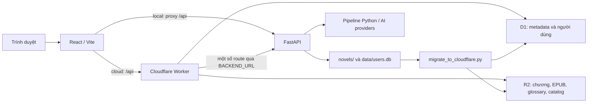

# Kiến trúc và dữ liệu

## Hai môi trường phục vụ

FastAPI chạy dịch, thao tác file và công cụ quản trị. Worker phục vụ website và dữ liệu cloud, không chạy Python. `BACKEND_URL` phải là địa chỉ Worker truy cập được; địa chỉ loopback của máy cá nhân không đáp ứng điều này. Route auth admin được proxy tới backend; thiếu cấu hình trả 503.

## Nguồn dữ liệu

| Dữ liệu | Local | Cloud |
|---|---|---|
| Hồ sơ truyện | `novels/<slug>/novel.json` | Bảng `novels` trong D1 |
| Bản gốc/bản dịch | `text_raw/`, `translated/` trong thư mục truyện | Nội dung chương ở R2; chỉ mục `chapters` ở D1 |
| Glossary | Hồ sơ truyện | `<slug>/glossary.json` ở R2, số lượng trong D1 |
| Mục lục | File/catalog và chương local | Gộp catalog legacy và D1 theo filename, D1 ưu tiên; Drive nếu chưa có mục lục |
| EPUB | File được công cụ build | `<slug>/book.epub` hoặc nguồn Drive |
| User, session độc giả, bookmark, progress, comment, request | `data/users.db` | D1, migration 002/003 |
| Phiên admin, job dịch | Bộ nhớ process Python | Admin được kiểm tra qua backend |

Tài khoản local và D1 là hai kho riêng; không có bằng chứng về luồng tự động đồng bộ toàn bộ tài khoản giữa chúng. Token admin (`authToken`) và độc giả (`userToken`) được frontend lưu riêng trong localStorage.

## Đồng bộ nội dung

`migrate_to_cloudflare.py` đưa dữ liệu local lên D1/R2 qua Wrangler. Ngoài ra có endpoint `POST /api/admin/sync-novel`, xác thực bằng header `x-sync-key` khớp Worker secret `SYNC_KEY`; các script gọi endpoint đọc `HACDAO_SYNC_KEY`.

Key mới dùng `<slug>/content/<sha256>.md`; key legacy có thể dùng tên file hoặc tên mã hóa `b64_...`; luôn dựa vào `chapters.r2_key` và manifest thực tế. Chế độ `--batch-upload` dùng `<slug>/bundles/manifest.json` và các bundle; mặc định tắt. Không giả định mọi chương đều là object Markdown độc lập.

Worker có fallback Google Drive; ghi cache chỉ khi `ENABLE_DRIVE_CACHE_WRITES=true`, mặc định tắt. Bật lại cache có thể phát sinh ghi R2/D1 từ lượt đọc.

R2 và D1 không có transaction chung. Sync ghi object immutable trước, sau đó D1 batch có điều kiện key kỳ vọng; không ghi catalog từ chunk. Lỗi một phần cần đối soát và retry. Công cụ migrate/bundle trực tiếp vẫn yêu cầu một writer mỗi slug.

## Giới hạn thiết kế

- Phiên admin và job state chưa bền vững qua restart; không hỗ trợ nhiều process backend an toàn.
- Rate limit Worker hỗ trợ binding theo nhóm và `Map` dự phòng theo isolate; chưa cấu hình/xác minh binding production. Ngân sách client không phải billing toàn account.
- Contract local/cloud khác nhau ở danh sách truyện và một số route. Thay đổi API phải kiểm tra cả hai implementation.
- Foundation ADK trong `agents/` chưa đồng nghĩa đã có QC tự động, pass 2 hay glossary auto-learn.
- Truyện tranh/OCR/dịch ảnh vẫn thuộc đề xuất lịch sử.
